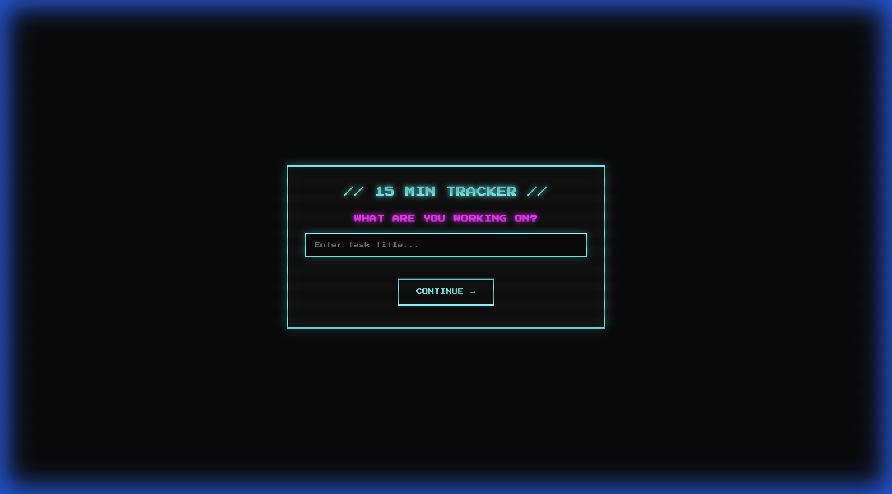
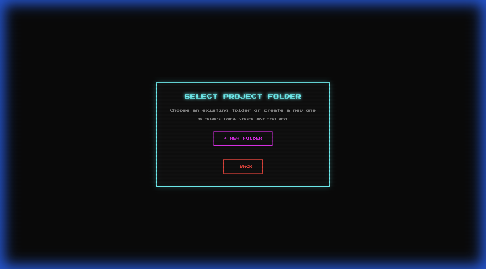
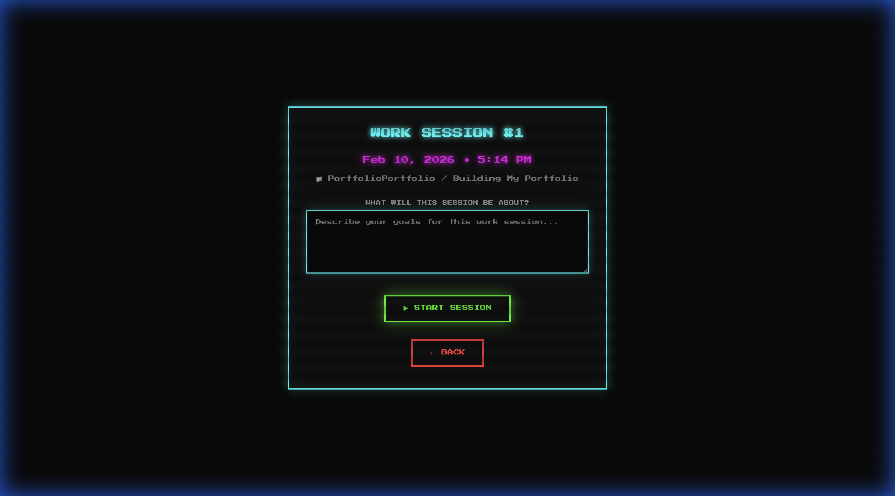
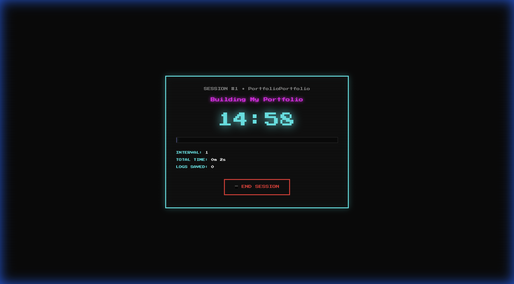

# ⏱️ 15 Min Tracker

A retro-styled local productivity tracker that breaks your work into focused 15-minute intervals. Inspired by an [Alex Hormozi short](https://www.youtube.com/@AlexHormozi) about the power of working in small, hyper-focused time blocks — if you can't focus for 15 minutes, you can't focus at all.

Built with **Next.js**, **TypeScript**, and a CRT-inspired retro UI.

---

## 📸 Screenshots

### Enter Your Task


### Organize by Folder


### Start a Session


### Stay Focused — 15 Minutes at a Time


---

## 🎮 How It Works

1. **Name your task** — What are you working on right now?
2. **Pick or create a folder** — Organize sessions by project (e.g. "Portfolio", "Study", "Side Hustle").
3. **Start your session** — Optionally describe your goals for this block.
4. **Work for 15 minutes** — A retro countdown timer with a neon progress bar keeps you locked in.
5. **Log your progress** — When the timer hits zero, an audio notification plays and a popup asks what you accomplished. You have 50 seconds to write it down (or it auto-saves).
6. **Repeat** — The timer resets and the cycle continues. Every interval is logged.
7. **End session** — When you're done, your logs are saved as a Markdown file in `work_sessions/<folder>/`.
8. **Auto-push to GitHub** — Session logs are automatically committed and pushed to your repo.

---

## 🔊 Volume Control

The timer view includes a built-in volume slider to control the notification sound. Click the speaker icon to mute/unmute, or drag the slider to set your preferred level.

---

## 🚀 Getting Started

### Prerequisites

- [Node.js](https://nodejs.org/) (v18+)
- [Git](https://git-scm.com/)

### Install & Run

```bash
git clone https://github.com/YOUR_USERNAME/15_Min_Alex.git
cd 15_Min_Alex
npm install
npm run dev
```

Open [http://localhost:3000](http://localhost:3000) in your browser.

---

## 📁 Project Structure

```
15_Min_Alex/
├── app/                  # Next.js app router
│   ├── api/              # API routes (folders, sessions, git-push)
│   ├── globals.css       # Retro theme & styles
│   ├── layout.tsx        # Root layout
│   └── page.tsx          # Main page
├── components/           # React components
│   ├── TitleInput.tsx    # Task title input
│   ├── FolderSelect.tsx  # Folder picker / creator
│   ├── SessionStart.tsx  # Session setup
│   ├── TimerView.tsx     # 15-min timer + logging popup
│   └── SessionEnd.tsx    # Session summary & git push
├── public/
│   ├── notification.mp3  # Timer notification sound
│   └── screenshots/      # README images
├── work_sessions/        # Your session logs (git-ignored)
└── README.md
```

---

## 🔒 Privacy Note

> **If you want your work session logs to stay private, make sure this GitHub repo is set to Private.**
>
> The `work_sessions/` directory is git-ignored by default, so your logs won't be committed. However, if you remove it from `.gitignore` to enable the auto-push feature (so your logs are backed up to GitHub), anyone with access to a public repo could see what you've been working on and when.
>
> **To make your repo private:** Go to your repo on GitHub → Settings → Danger Zone → Change repository visibility → Private.

---

## 🛠️ Tech Stack

- **Next.js 14** (App Router)
- **React 18** + TypeScript
- **Press Start 2P** font (retro pixel font)
- **Vanilla CSS** with CRT scanline effects, neon glows, and pixel-art aesthetics

---

## 💡 Inspiration

This app was inspired by a short I watched by **Alex Hormozi**. The idea is simple: if you can't sit down and focus for just 15 minutes, something is wrong. Break your work into tiny 15-minute blocks, log what you did, and watch how much more you actually get done. No excuses — just start the timer.

---

*Built with focus. One 15-minute block at a time.*
